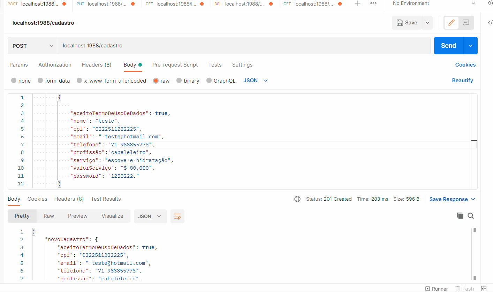

## Turma Online 14 - Todas em Tech | Back-end | 2021 |

# Projeto-livre-reprograma
Óla , sejam bem vindo ao meu primeiro projeto livre , espero tratar com muita clareza para que voces possam entender cada detalhe que foi produzido com muito amor.


# Nome do Projeto  - DELIVERY DA BELEZA 

### Tema : Fique linda no conforto de sua casa.

<h1 align="center">
  
<p align="center"><p>
</h1>

## 🚀 Descrição


   >Devido a grande alta de desemprego no pais principalmente após inicio da pandemia , estudos mostram um aumento na taxa de autônomos no mercado de trabalho , visto que muitas pessoas estão em casa desempregadas , mais uma vez a população precisa se reinventar e estão atuando no mercado de trabalho de forma informal , para sua propria sobrevivência.<br>

   >
   >Pensando nisso desenvolvi esse projeto Delivery da beleza ,onde os profissionais  da area da beleza e autonomos podem encontrar uma plataforma para se  cadastrar , ajudando na divulgação de seus serviços  e fazendo uma relaçao de forma mais facil para acesso a clientes novos , por outro lado tambem temos os clientes que com essa plataforma teria a facilidade de encontrar e contactar profissionais da área de beleza para um atendimento personalizado em domicilio.

  >Fonte de pesquisa : (https://www.jornalcontabil.com.br/numero-de-trabalhadores-autonomos-bateu-recorde-no-segundo-trimestre-de-2021/)
  >Fonte de pesquisa : (https://g1.globo.com/economia/noticia/2021/11/22/brasil-tem-a-4a-maior-taxa-de-desemprego-do-mundo-aponta-ranking-com-44-paises.ghtml)

# Sumário
=================
<!--ts-->
   * [Objetivos](#objetivos)
   * [Aprendizados](#aprendizados)
   * [Arquitetura Model View Controller](#arquitetura)
   * [Instalação](#instalação)
      * [Pre Requisitos](#pré-requisitos)
      * [Rodando o Back End](#rodando-o-back-end)
      * [Tecnologias](#tecnologias)
      * [Features](#features)
      * [Rotas](#rotas)
   * [Modelo com campos obrigatórios para teste: Postman ou Insomnia](#modelo-com-campos-obrigatórios-para-teste)
   * [Agradecimentos](#agradecimentos)
<!--te-->

## ✅Objetivos

- Cadastro de profissionais da beleza e seus serviços disponiveis;
- Busca de serviços para clientes interessados;
- Atualizaçao de dados de profissionais em relaçao aos serviços disponiveis ;
- Delete seria a exclusão desse cadastro ;


## ✅Aprendizados

O projeto final consiste em uma API fundamentada no CRUD, que são:  CREATE (CRIAR), READ(LER-CONSULTA), UPDATE(ATUALIZAR) e DELETE(). 

## ✅Arquitetura

        Arquitetura MVC
        |
        \--📂DELIVERY_DA_BELEZA
            | .assets
            |
            | .node modules  
            |   
            \--📂src
                |
                📂---controller
                |       
                |   .parceirosController.js
                |
                📂--database
                |    .config.js   
                |
                📂--middlewares
                |
                |  .auth.js
                |
                📂---models
                |       
                |     .parceirosModels.js  
                |     
                |       
                📂---routes
                |      
                |     .parceirosRoutes.js
                |
                | .app.js
                |.env
                |.env.example
                | .gitignore
                |*package-lock.json
                |*package.json
                |.procfile
                | .projeto.txt
                |*README.md
                |*server.js
                |
                |_      
 


## ✅Instalação
* Para realizar download do projeto, siga as instruções abaixo:

### 👩‍👧‍👦Pré-requisitos

Você precisa ter instalado em sua máquina as seguintes ferramentas:
[Git](https://git-scm.com), [Node.js](https://nodejs.org/en/) e o database NoSQL [mongo Atlas](https://www.mongodb.com/pt-br/cloud/atlas/register)
E claro o bom e velho editor de código como [VSCode](https://code.visualstudio.com/);

### 👩‍👧‍👦Rodando o Back End 

Server Local

```bash
# Com o git
# Clone este repositório
$ git clone <https://github.com/Daniele2024/Projeto-livre-reprograma>

# Acesse a pasta do projeto no terminal/cmd
$ cd DELIVERY_DA_BELEZA

# Instale as dependências
$ npm init -y
$ npm express
$ npm nodemon
$ npm install
$ npm instal mongoose

# Execute o servidor
$ npm start

# O servidor inciará na porta:1988 - acesse <http://localhost:1988>

```
* Modifique `.env` para receber as variáveis de ambiente e substitua para que seu servidor funcione adequadamente

Para acessar via Heroku, acesse o [link da API FILTRAR]<https://deliverydabeleza-reprograma-21.herokuapp.com/filtrar>

* Utilize o [Postman](https://www.postman.com/) ou [Insomnia](https://insomnia.rest/download/) para para chamar e testar os endpoints da API localmente ou via Heroku

## 🛠Tecnologias

Para a consturição do projeto, as seguintes tecnologiasforam utilizadas:

- [JavaScript](https://www.javascript.com/)
- [Git/Github](https://github.com/)
- [Node.js](https://nodejs.org/en/)
- [MongoDb](https://www.mongodb.com/)
- [Mongoose](https://mongoosejs.com/)
- [Nodemon](https://nodemon.io/)
- [Express](https://expressjs.com/pt-br/)
- [dotenv](https://www.npmjs.com/package/dotenv)
- [cors](https://www.npmjs.com/package/cors)
- [heroku](https://dashboard.heroku.com/apps)

### 👩‍👧‍👦Recursos

Funcionalidades da aplicação

- [x] Cadastros do parceiros - POST
- [x] Busca - GET - lista de todos cadastrados e seus dados
- [x] Busca - Get filtrar -filtro para o cliente , lista de profissionais e seus serviços
- [x] Atualização em todos os campos - PUT
- [x] Apagar - DELETE

### 👩‍👧‍👦Rotas

* Heroku link deploy:https://deliverydabeleza-reprograma-21.herokuapp.com/

* local: http://localhost:1988

rota principal  ('/',)

//rota para visualizar toda lista de cadastro 
router.get("listarTodosdados", controller.listarTodosParceiros)

//rota para visão cliente com dados do profissional e seus serviços
router.get("/filtroCliente", controller.filtrarParceiros)

//rota para cadastro do profissional
router.post("/criar",controller.cadastrarParceiros)

//rota para atualizaçao do cadastro
router.put("/atualizar/:id", controller.atualizarParceiros)

//rota para exclusão do cadastro
router.delete("/deletar/:id",controller.deletarParceiroPorId)


<h1 align="center">
  
<p align="center"><p>
</h1>


## ✅Modelo com campos obrigatórios para teste no postman

### 👩 post / cadastro de profissional 

{
   aceitoTermoDeUsoDeDados : type: Boolean,
    
    nome: type: String 

    cpf:  type: String

    email:  type: String

    telefone: type: String 

    profissão:type: String 

    serviço: type: String 

    valorServiço:type: String
    
    password: type: String
}


### 🚧 Implementaçoes futuras

      *  A possibilidade de incluir no cadastro do profissional um catalogo de serviço .
      *  A possibilidade do cliente realizar um agendamento de forma  on line na plataforma.
      
        
        


# Agradecimentos

<p align="justify">Agradeço primeiramente a Deus pela oportunidade de fazer este curso e me da força para consegui terminar, pois foi um desafio muito grande o conhecimento de uma nova limguagem de programação , agradeço muito a minha familia , meu esposo Kaio , meu irmão Gilson , meu filho kaique  que é minha inspiraçao de mudança de vida e todo apoio que tive para  nunca desistir , tambem a reprograma é claro por ter me selecionado  e pela oportunidade de consegui fazer esse bootcamp  , muito bom todo esse aprendizado e as amizades feitas ,pessoas maravilhosas dessa turma todas  as  professoras , a Raquel nossa facilitadora e Jess nossa cordenadora , e principalmente as alunas e colegas e amigas sempre uma ajudando a outra e assim conseguimos chega ao final , agradeço a todas meninas ta turma ON14 .E a Tassila que me apresentou esse curso  e a Reprograma , obrigada por partilhar a experiencia e me envolver com todo esse projeto de transição de carreira , o que possibilitou a chegar ate aqui , obrigada Tay <br>


Deus é a minha fortaleza e com ele tudo posso , ate mesmo programar o mundo!</p>

